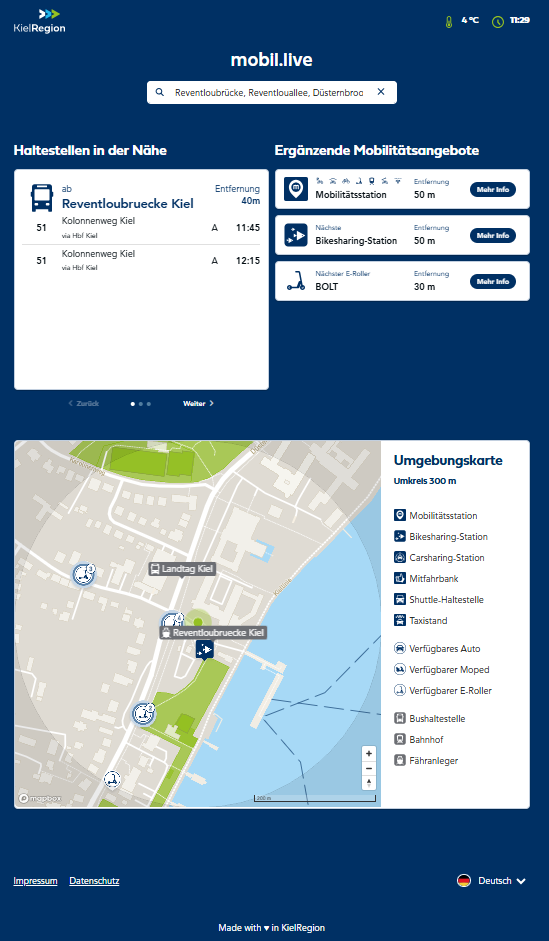

# mobil.live
mobil.live ist eine Mobilitätsanwendung der KielRegion, welche die verschiedenen Mobilitätsangebote auf jedem webfähigen Gerät, wie Smartphones oder Tablets darstellt. Die in der Anwendung angezeigten Mobilitätsangebote werden vom MLA abgerufen.

## Sourcen
Der Sourcecode des mobile.live wird von der Firma Hanseatics entwickelt und gepflegt. Er ist notwendig, um daraus ein entsprechendes Docker-Image zu erzeugen.

## TL;TR

```bash
docker build -t mobile-live:latest .
````

## Screenshot


## Links
https://mobil.kielregion.de/